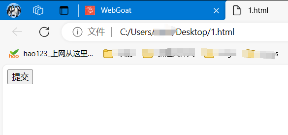
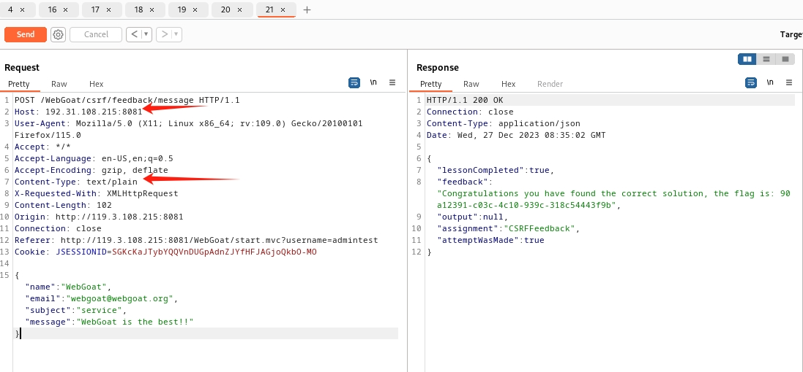
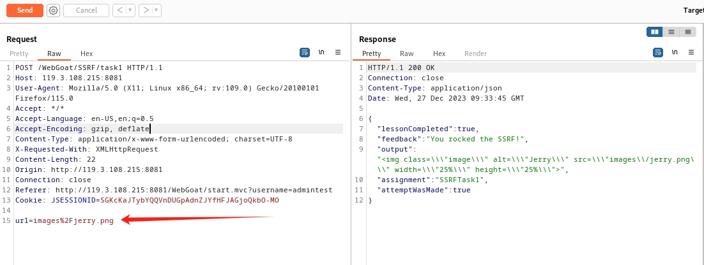
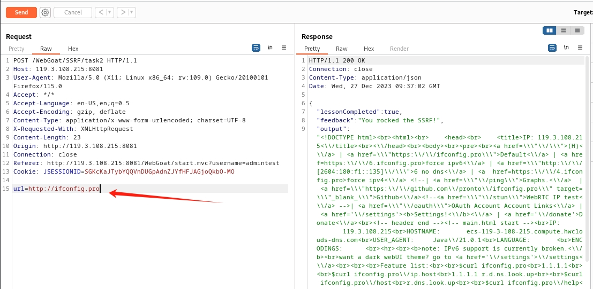
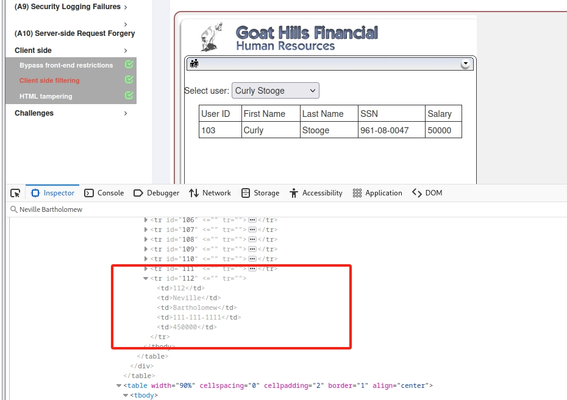
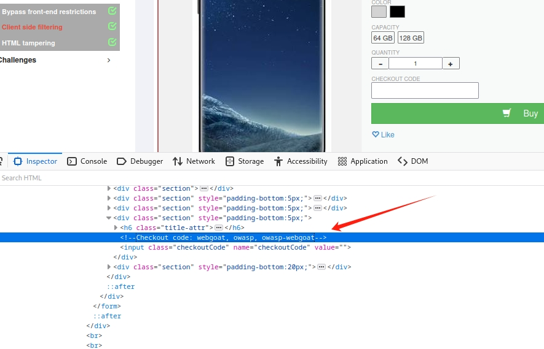
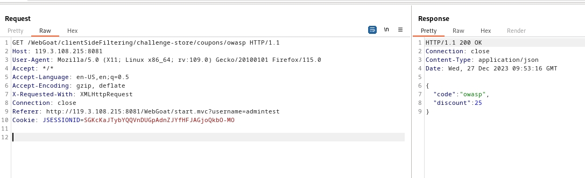
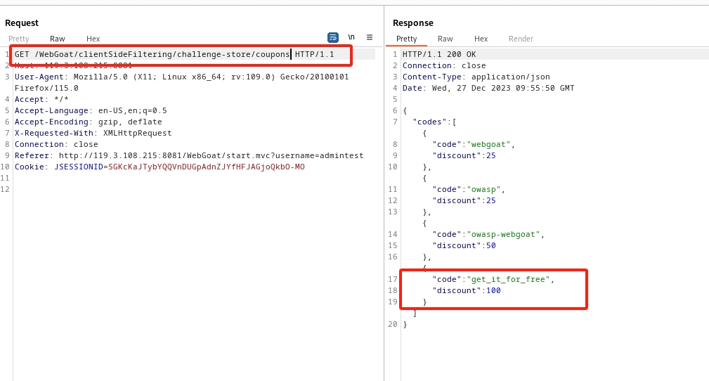

## A10 Server-side Request Forgery
### 1. Cross-Site Request Forgeries
+ 1-3, 这里有个submit query按钮，直接点击会提示来自相同host，我们改下请求的host就可以拿到flag，  
这是最简单的方法，但这里应该不是这个目的。xsrf通常是同一浏览器的不同网站之间有恶意行为。所以我们要自己写一个html文件来模拟外站，复制sub query那个form
```
<html>
<body>
<form accept-charset="UNKNOWN" id="basic-csrf-get" method="POST" name="form1" 
target="_blank" successcallback="" 
action="http://127.0.0.1:8081/WebGoat/csrf/basic-get-flag">
     <input name="csrf" type="hidden" value="false">
      <input type="submit" name="submit">

    </form>
</body>
</html>
```
然后在同一个浏览器打开，点击提交按钮



+ 1-4, 这关同上，也是改host，也可以构造html，然后填表提交

+ 1-7， 这关需要在外站用json提交数据，因为json提交会有cros检验限制，所以这关出了修改host外，还需将Content-Type改为 text/plain
 

+ 1-8, 这关只需新注册个用户，用户名为当前用户名前加csrf-，然后在同一浏览器登录。再点击solved即可

### 2. Server-Side Request Forgery

+ 2-2,这关修改请求获取不同的服务器资源，直接修改图片名称即可


+ 2-3, 这关也是直接修改请求，将请求改为一个地址，这样返回的就是地址的内容了，地址是个外站


## client side
### 1.Bypass front-end restrictions
一共两关，都特别简单，页面以正则的方式限制了输入的内容，我们抓包绕过前端，然后直接修改就可以

### 2. Client side filtering

+ 2-2，这里是想获取Neville Bartholomew的薪水，页面没展示，但是看源码是可以直接看到的


+ 2-3, 这关是需要我们找到checkout code，从源码给的提示我们可以看到checkout code有webgoat, owasp, owasp-webgoat  


我们分别填入去试试，发现有个请求时返回不同code的折扣的  


我们修改这个请求，把后面的code去掉，发现返回的是所有的code列表。可以看到有我们想要的。 


### 3. HTML tampering
+ 3-2,这个直接抓包改数字就可以，没什么好说的


