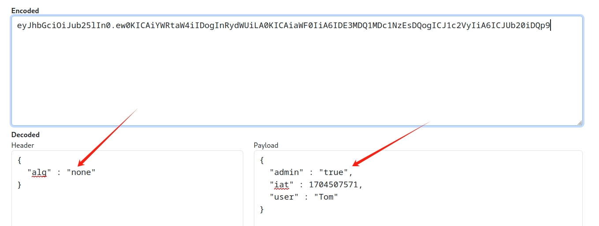

## A7 Identity & Auth Failure
### 1. Authentication Bypasses

+ 1-2,这关是重置密码的时候有的不能收到短信，这是需要回到安全问题。然后我们想办法绕过这些安全问题。这里绕过的方法很简单，但是很难想到。不知道到底谁会这么干的。就是改到安全问题的序号，secQuestion0和secQuestion1改成secQuestion3和secQuestion4就可以。


### 2. Insecure Login
+ 2-2,这关先点击log in按钮，这是会返回一个js，抓包能看到。  
  
这段代码包含一段16进制字符，我们先转码。转码就直接用chatgpt了（再也不用网上到处找工具了，哈哈）

可以看到用户名和密码就是数组的0和1，也就是CaptaiJack和BlackPearl

### 3. JWT tokens

+ 3-4，这关直接将jwt解码可以获得用户名为 user
+ 3-6, 这关是需要我们以admin的权限重置投票结果，默认是guest，先切换tom的身份重置试试，返回结果：

我们将jwt在wolf解码，发现admin字段是false，改成true。直接这样是不行的，因为jwt还有签名，签名是可以绕过的，只需要将alg改成none.重新生成jwt。注意没有签名jwt第三部分是空，但是那个分隔符点是要的，不然格式不正确。


+ 3-8,看不到题，跳过。

+ 3-11，jwt的key是可以爆破的，这关就是通过爆破获取key，然后重新生成jwt。爆破我们可以用hashcat，kali自带。  
```
hashcat -a 0 -m 16500 jwtstring wordlist
```

得出key是shipping  

+ 3-13,这关是要实现使用tom的身份付款，当前的身份是jerry。还提供了一个日志文件。里面也有一个token，解码是tom的，但是日期过期了。所以这关有两个思路，一个是改当前token,把用户改成tom,再重新编码jwt，另一个是改日志文件里的token,改有效时间。不过这两种都会遇到jwt签名的问题。要么设置none绕过，要么爆破获取key。这里我试了字典爆破都没成功就选择绕过了


+ 3-16,
+ 3-18,这两关是jku和kid的比较麻烦，跳过

### 4. Password reset

+ 4-2， 这一关就是重置密码，在忘记密码页面填入账户，然后在webwolf就能收到。没什么可说的。

+ 4-4，这关是对密码安全问题的爆破，因为有的密保问题太简单了，比如这里的颜色。这关也简单。

+ 4-5，这关直接点就行
+ 4-6，这关是要重置他人密码，我们先用自己账户试下。用自己账户测试，在webwolf会收到一个重置连接，点进去就可以重置密码： 
  
从这个连接就可以看出，区分用户的是后面的那个token。所以我们要获取tom的token.而token是在邮箱的链接里的，如果我们能拦截到发往邮箱的请求就能获取到token,思路是这样的，但是怎么拦截就是这个问题了。正常都拦不到，这里是看了源码才知道，后端代码是根据请求字段host来发的，所以这里只要改掉host为127.0.0.1:9090,邮件请求就发到我们的webwolf啦。

然后在webwolf里就能看到请求了


### 5. Secure Passwords
+ 5-4 这关就是设置一个强度大一点的密码


## A8 Software & Data Integrity

### 1. Insecure Deserialization
+ 1-5 反序列化，这个要看源码了，从源码可以看到反序列化的是VulnerableTaskHolder 这个类，而且只能执行sleep和ping命令。

我们直接用代码生成序列化字符串


## A9 Security Logging Failures
### 1. Logging Security
+ 1-2,这关不知道啥意思，直接输入admin就过了。

+ 1-4，有的服务初始化的时候会把管理员的初始密码打印在日志里，比如mysql，所以我们可以去日志里找密码，就在启动的时候。
  


