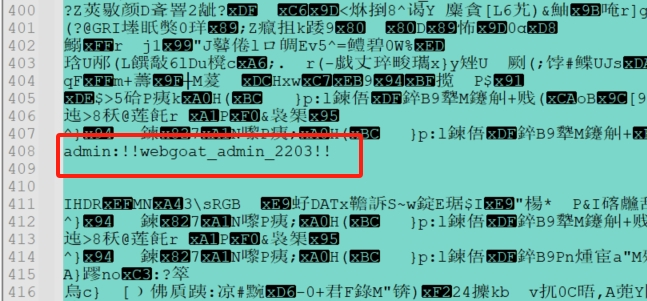
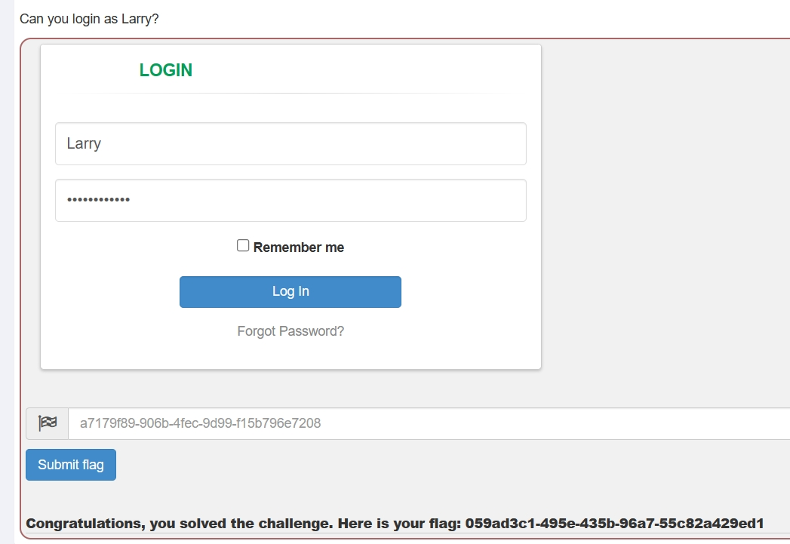
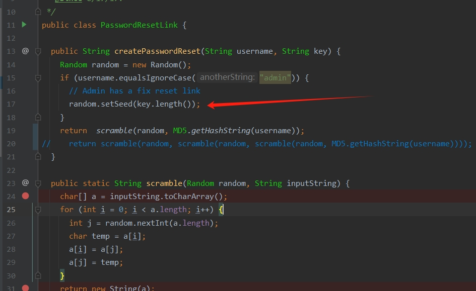
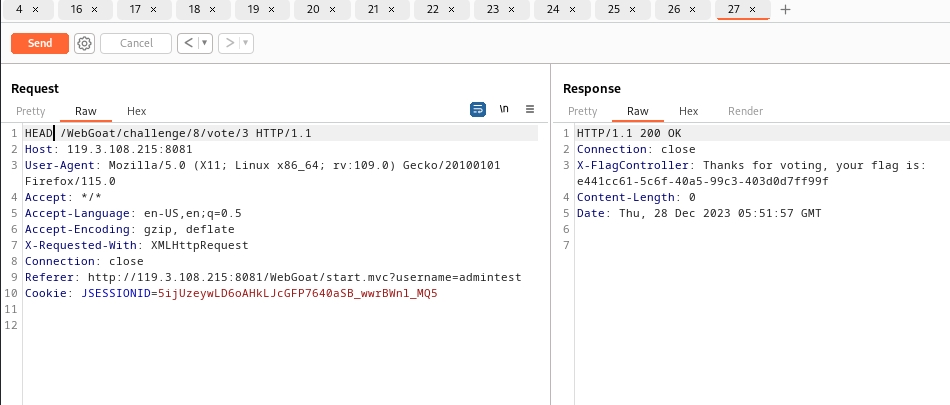

## challenges
### 1. Admin lost password
这关要求是要找到admin的密码登录。第一个肯定想到的是sql注入，但是试了几下都不行，然后看了前端代码也没找到什么线索。题目也提示了爆破是不行的。这就没辙了。后来网上看了答案，简直让人震惊。密码竟然藏在那个图片里，下载logo，然后记事本打开就可以看到,我想现实中应该没有人会这么干嘛，不知道这题的意义何在 。

### 2.Without password
这关可以使用sql注入

### 3. Admin password reset
这关目标和以前的重置密码一样，但是原来的方法不行了，原来修改host能直接拦截邮件请求。这里不行。直接说结果，网上看的答案，这里有个git源码泄露的漏洞，请求WebGoat/challenge/7/.git就能下载到.git文件，然后就能看到生成token的源码，

从源码可以看出这里随机生成设置了一个种子，这个种子是固定的。那这里就会有个问题，当设置相同的种子后，random生成的随机序列是一样的。也就是伪随机，所以这里我们也就可以生成admin的token。 

 ### 4. Without account

 这关只要把GET改成HEAD就可以了，后端使用了spring boot的@GetMapping注解，但这个注解并有限制head请求
 

