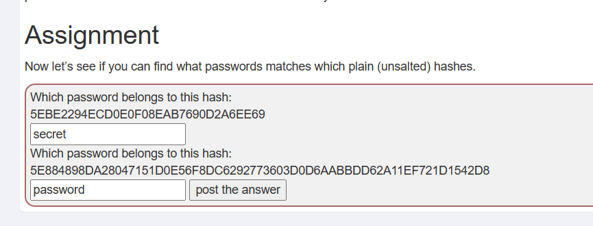

#  WebGoat 介绍
WebGoat是OWASP组织研制出的用于进行WEB漏洞实验的应用平台，用来说明WEB应用中存在的安全漏洞。WebGoat基于java开发，包含了owasp Top10的漏洞训练课程。

# WebGoat 环境搭建
WebGoat一直在更新，每个版本会有所不同，我这里用的最新版本2023.8，github地址<a href="https://github.com/WebGoat/WebGoat">webgoat</a>。  
安装我也采用最简单的安装方式：docker安装，安装命令：
```
docker run  -p 8080:8080 -p 9090:9090 webgoat/webgoat
```
然后页面直接访问8080端口即可，初始页面如下： 
 
没有账号要先注册个账号。

# 开始关卡

## general
基础介绍关，介绍一些概念和调试方法
### 1. HTTP Basic
+ 1-2，这关就是发个http请求，填入用户名，然后会返回反转后的用户名
+ 1-3，这里问我们这一课请求是用的什么方式，还有一个magic_num是什么。请求方式我们可以看前一个关卡的请求，知道是post，至于magic_num是啥就不知道了。这里我找了好久都没找到，后来随便填了个数，然后去看请求。发现竟然在请求body里。  


### 2. HTTP Proxies
+ 2-5,这关需要你设置一个代理，然后拦截请求，并将请求修改。我用的burpsuit,打开bp设置代理，并打开拦截。浏览器也设置代理。修改的3个地方，将GET改为POST，添加header即x-request-intercepted:true，将请求参数改为Requests are tampered easily，并拼接到url。


### 3. Developer Tools
+ 3-4,这关是要使用浏览器的控制台，F12打开控制台，敲入webgoat.customjs.phoneHome()就可以看到想要的数字。

+ 3-6,这关是查看请求参数，没什么好说的。

### 4. CIA Triad
这关是介绍数据的三要素，机密性，完整性，可用性。
+ 4-5，这关我网上看是做选择题，但是我这份环境没有题目。不知道啥问题，不管了，先放着。

## (A1) Broken Access Control

### 1. Hijack a session
+ 1-2,这关是要根据cookie的生成规律，推测正确的cookie,我们先请求几次，找一下cookie返回cookie的规律。发现在返回响应中有一个相应头：Set-Cookie: hijack_cookie=3805806745390473234-1702722939700; 这个就是我们要找规律的cookie，可以发现，它是由两部分组成的，而且两部分都是递增的，前一部分增的慢，后一部分增的跨度大，前半部分有的是间隔一个递增的，我们可以选中间那个，确定前一部分，然后后半段就是那个区间了，接下来就只能爆破了，可以直接使用bp。设置如下，转到intrude

设置payload


查看结果，有个返回长度不一样，就是这个了


### 2. Insecure Direct Object References

+ 2-2,直接使用tom/cat登录
+ 2-3,这关是要找出用户的两个属性，服务器返回的信息是全的，但是页面只展示一部分，所以直接查看请求响应就能看到role和userId两个没展示出来。
+ 2-4，有了上一关的Id，这里让我们猜获取profile的url，结合上一贯的url:/WebGoat/IDOR/profile,按restful的习惯，不难猜是WebGoat/IDOR/profile/2342384
+ 2-5，这里是要我们使用同样的方法获取其他人的信息，所以只要替换不同的id去请求就行，使用爆破的方法，最后可以知道id=2342388的用户。第二步是修改该用户信息，将该请请求由get改成put，并将要修改的信息放到body，将color改成red，role改成低级别。


### 3. Missing Function Level Access Control
+ 3-2,这关是要找出页面的隐藏信息，从html源码可以看出这里隐藏的两个菜单链接。分别是Users和Config

+ 3-3,这一关意思是从上面隐藏的链接里可能会泄露信息，从链接里得到用户jerry的hash值，这里我们访问隐藏链接users,拼出url，还要修改Content-Type: application/json.这样就能得到所有用户信息了。


+ 3-4,这一关意思是，之前那个页面已经修复了，只有admin权限的才能访问那个页面，我们直接访问users-admin-fix ，会返回403 Forbidden。所以接下来我们就要想办法提升访问者的权限，根据提示，我们可以先用post修改用户的权限，将admin改为true，因为我当前登录用户是admintest.

修改之后，我们再使用get请求就又可以拿到用户列表了


### 4. Spoofing an Authentication Cookie
+ 4-2,这一关是让我们找出cookie的生成方式，然后构造一个用户的cookie,题目给了两个用户，我们先用着两个用户登录，看响应。发现cookie如下：
```
webgoat spoof_auth="NmU0ODU3NDU1ODVhNzg0MjY0NDI3NDYxNmY2NzYyNjU3Nw=="
admin   spoof_auth=NmU0ODU3NDU1ODVhNzg0MjY0NDI2ZTY5NmQ2NDYx
```
这看着就很象base64编码，所以我们试着先解码,分别得到
```
6e485745585a7842644274616f67626577
6e485745585a784264426e696d6461
```
这两字符串看着像16进制编码，我们再解码看看
```
nHWEXZxBdBtaogbew
nHWEXZxBdBnimda
```
到这里还是一堆乱码，其实到这里我当时也没头绪了，并没找到规律，后来参考其他人的才知道。规律就是 nHWEXZxBdB+用户名的反转。那我们只要拼出Tom的就好了，nHWEXZxBdBmoT,转16进制为6e485745585a784264426d6f54 ，再转base64得到 NmU0ODU3NDU1ODVhNzg0MjY0NDI2ZDZmNTQ=，添加cookie，再请求即可


## (A2) Cryptographic Failures
### 1. Crypto Basics
这部分主要是密码加密问题
+ 1-2，直接base64解码就得到用户名和密码。
+ 1-3, 这关也是解码，XOR是异或运算的意思，异或运算需要两个数，另一个数也就是密钥现在还不知道。这个我当时也没想出来，看了别人的答案，原来这里使用的是BM WebSphere，里面异或运算默认的是'_',把这个拿去算得到：databasepassword

+ 1-4,这关需要破解哈希加密，可能是MD5也可能是sha1,https://www.cmd5.org/ 是一个专门破解哈希的网站，直接就能破解。得到答案secret和password

+ 1-6,这关涉及RSA密钥，给出了一个私钥需要算出公钥的modulus还有签名，具体算法可以网上查，提示上面也有，具体过程：  
将给的私钥保存为test.key,生成公钥
openssl rsa -in test.key -pubout > test.pub    
生成modulus  
openssl rsa -in test.pub -pubin -modulus -noout
然后用生成的modulus生成signature并用base64编码    
 echo -n "00AE89..." | openssl dgst -sign test.key -sha256 |base64  
+ 1-8，这关是需要找到一个密钥，解开题目的一段密文，这个密钥是放在一个docker容器里，这里我们要运行这个容器，然后到/root/下面找到密钥文件。  
运行容易：  
docker run -d webgoat/assignments:findthesecret  
root身份进入容器：
 docker exec -it --user=root 34580 /bin/bash
 